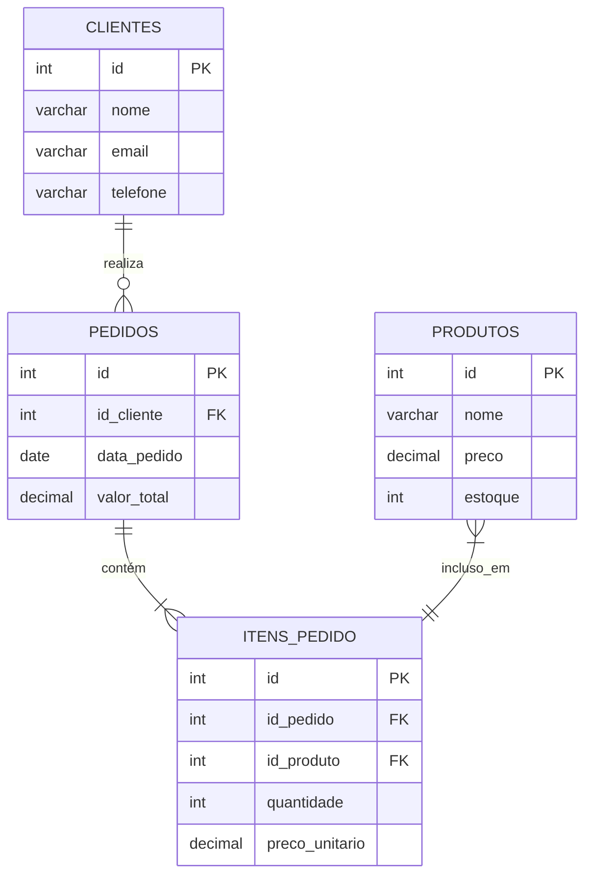
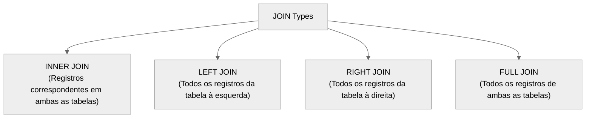
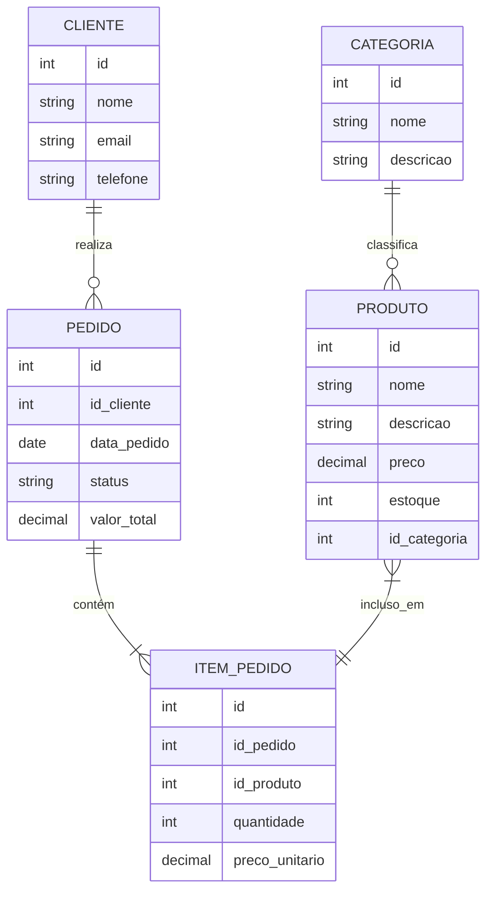

<style>
    body {
        font-family: Arial, sans-serif;
        line-height: 1.6;
        max-width: 1000px;
        margin: 0 auto;
        padding: 20px;
    }
    h1 {
        color: #3a3a3a;
        text-align: center;
        border-bottom: 2px solid #3a3a3a;
        padding-bottom: 10px;
    }
    h2 {
        color: #2c3e50;
        margin-top: 30px;
        border-bottom: 1px solid #eee;
        padding-bottom: 5px;
    }
    h3 {
        color: #3498db;
        margin-top: 20px;
    }
    .section {
        background-color: #f9f9f9;
        padding: 15px;
        margin-bottom: 20px;
        border-radius: 5px;
        border-left: 5px solid #3498db;
    }
    .code {
        background-color: #f5f5f5;
        font-family: 'Courier New', monospace;
        padding: 15px;
        border-radius: 5px;
        overflow-x: auto;
    }
    pre {
        background-color: #f5f5f5;
        padding: 15px;
        border-radius: 5px;
        overflow: auto;
    }
    table {
        width: 100%;
        border-collapse: collapse;
        margin: 15px 0;
    }
    th, td {
        border: 1px solid #ddd;
        padding: 8px;
        text-align: left;
    }
    th {
        background-color: #f2f2f2;
    }
    .note {
        background-color: #e8f4fd;
        padding: 10px;
        border-radius: 5px;
        border-left: 5px solid #3498db;
        margin: 15px 0;
    }
    .warning {
        background-color: #fff3e0;
        padding: 10px;
        border-radius: 5px;
        border-left: 5px solid #ff9800;
        margin: 15px 0;
    }
    .tip {
        background-color: #e0f7fa;
        padding: 10px;
        border-radius: 5px;
        border-left: 5px solid #00bcd4;
        margin: 15px 0;
    }
</style>

# Fundamentos de SQL com PostgreSQL

## Visão Geral

Este documento apresenta os conceitos fundamentais de SQL (Structured Query Language) utilizando o PostgreSQL como sistema gerenciador de banco de dados relacional (SGBD) de referência. O conteúdo abrange desde comandos básicos até operações mais avançadas, incluindo exemplos práticos e diagramas explicativos.

## 1. Introdução ao SQL e PostgreSQL

<div class="section">

SQL (Structured Query Language) é uma linguagem padrão para trabalhar com bancos de dados relacionais. Ela permite criar, manipular e consultar dados armazenados em tabelas.

### O que é PostgreSQL?

PostgreSQL é um sistema de gerenciamento de banco de dados relacional (SGBD) de código aberto e extremamente poderoso. Conhecido por sua robustez, conformidade com padrões e extensibilidade, o PostgreSQL oferece:

-   Conformidade com ACID (Atomicidade, Consistência, Isolamento e Durabilidade)
-   Suporte a tipos de dados avançados
-   Extensibilidade através de procedimentos armazenados em várias linguagens
-   Sistema de tipos complexo com suporte a arrays, JSON, dados geoespaciais, etc.
-   Replicação e alta disponibilidade

### Por que aprender SQL?

-   Habilidade fundamental para trabalhar com dados
-   Utilizado em diversos sistemas e aplicações
-   Base para análise de dados e business intelligence
-   Demanda constante no mercado de trabalho

</div>

## 2. Conceitos Básicos de Bancos de Dados Relacionais

<div class="section">

### Terminologia Essencial

-   **Banco de dados**: Coleção organizada de dados estruturados
-   **Tabela**: Estrutura que organiza dados em linhas e colunas (similar a uma planilha)
-   **Coluna**: Representa um tipo específico de dado (também chamado de campo ou atributo)
-   **Linha**: Um registro ou entrada individual na tabela (também chamado de tupla)
-   **Chave Primária**: Identificador único para cada registro
-   **Chave Estrangeira**: Campo que estabelece relacionamento com outra tabela

### Exemplo de Modelo Relacional



</div>

## 3. Instalando e Configurando PostgreSQL

<div class="section">

### Instalação

No Ubuntu ou Debian:

```bash
sudo apt update
sudo apt install postgresql postgresql-contrib
```

No Windows ou Mac:

-   Baixe o instalador em [postgresql.org/download](https://www.postgresql.org/download/)
-   Siga as instruções do assistente de instalação

### Conectando ao PostgreSQL

Via linha de comando:

```bash
psql -U postgres
```

Você será solicitado a inserir a senha definida durante a instalação.

### Ferramentas Gráficas Populares

-   pgAdmin 4: Ferramenta oficial de administração para PostgreSQL
-   DBeaver: Cliente universal de banco de dados
-   DataGrip: IDE para SQL da JetBrains

</div>

## 4. Criando um Banco de Dados

<div class="section">

### Criando um Novo Banco de Dados

```sql
CREATE DATABASE loja_virtual;
```

### Conectando ao Banco de Dados

```sql
\c loja_virtual
```

### Tipos de Dados Comuns no PostgreSQL

<table>
  <tr>
    <th>Tipo de Dado</th>
    <th>Descrição</th>
    <th>Exemplos</th>
  </tr>
  <tr>
    <td>INTEGER ou INT</td>
    <td>Número inteiro</td>
    <td>42, -8, 0</td>
  </tr>
  <tr>
    <td>DECIMAL(p,s), NUMERIC(p,s)</td>
    <td>Número decimal com precisão exata</td>
    <td>9.99, 3.14159</td>
  </tr>
  <tr>
    <td>VARCHAR(n)</td>
    <td>Texto de tamanho variável</td>
    <td>'João', 'São Paulo'</td>
  </tr>
  <tr>
    <td>TEXT</td>
    <td>Texto de tamanho ilimitado</td>
    <td>'Descrição longa...'</td>
  </tr>
  <tr>
    <td>DATE</td>
    <td>Data (sem hora)</td>
    <td>'2023-07-19'</td>
  </tr>
  <tr>
    <td>TIMESTAMP</td>
    <td>Data e hora</td>
    <td>'2023-07-19 15:30:00'</td>
  </tr>
  <tr>
    <td>BOOLEAN</td>
    <td>Valor lógico</td>
    <td>TRUE, FALSE</td>
  </tr>
  <tr>
    <td>SERIAL</td>
    <td>Inteiro com autoincremento</td>
    <td>Usado geralmente como ID</td>
  </tr>
</table>

### Criando Tabelas

```sql
CREATE TABLE clientes (
    id SERIAL PRIMARY KEY,
    nome VARCHAR(100) NOT NULL,
    email VARCHAR(100) UNIQUE NOT NULL,
    telefone VARCHAR(20),
    data_cadastro DATE DEFAULT CURRENT_DATE
);

CREATE TABLE produtos (
    id SERIAL PRIMARY KEY,
    nome VARCHAR(100) NOT NULL,
    descricao TEXT,
    preco DECIMAL(10, 2) NOT NULL CHECK (preco > 0),
    estoque INT NOT NULL DEFAULT 0
);

CREATE TABLE pedidos (
    id SERIAL PRIMARY KEY,
    id_cliente INT REFERENCES clientes(id),
    data_pedido TIMESTAMP DEFAULT CURRENT_TIMESTAMP,
    status VARCHAR(20) DEFAULT 'pendente',
    valor_total DECIMAL(10, 2)
);

CREATE TABLE itens_pedido (
    id SERIAL PRIMARY KEY,
    id_pedido INT REFERENCES pedidos(id),
    id_produto INT REFERENCES produtos(id),
    quantidade INT NOT NULL CHECK (quantidade > 0),
    preco_unitario DECIMAL(10, 2) NOT NULL,
    UNIQUE (id_pedido, id_produto)
);
```

### Restrições Comuns em Tabelas

-   **NOT NULL**: Impede valores nulos
-   **UNIQUE**: Garante valores únicos na coluna
-   **PRIMARY KEY**: Identifica cada registro de forma única
-   **FOREIGN KEY**: Cria relacionamento com outra tabela
-   **CHECK**: Define uma condição que os valores devem atender
-   **DEFAULT**: Define um valor padrão

</div>

## 5. Consultas Básicas (SELECT)

<div class="section">

### Selecionando Todos os Dados

```sql
SELECT * FROM clientes;
```

### Selecionando Colunas Específicas

```sql
SELECT nome, email FROM clientes;
```

### Filtrando com WHERE

```sql
SELECT * FROM produtos WHERE preco > 100;

SELECT * FROM clientes WHERE nome LIKE 'Mar%';

SELECT * FROM pedidos WHERE data_pedido >= '2023-01-01' AND status = 'entregue';
```

### Ordenando Resultados

```sql
SELECT * FROM produtos ORDER BY preco ASC;

SELECT * FROM clientes ORDER BY nome ASC, id DESC;
```

### Limitando Resultados

```sql
SELECT * FROM produtos ORDER BY preco DESC LIMIT 5;
```

### Agregação de Dados

```sql
SELECT COUNT(*) FROM clientes;

SELECT SUM(valor_total) FROM pedidos WHERE status = 'entregue';

SELECT AVG(preco) FROM produtos;

SELECT MIN(preco), MAX(preco) FROM produtos;
```

### Agrupando Resultados

```sql
SELECT status, COUNT(*) FROM pedidos GROUP BY status;

SELECT id_cliente, SUM(valor_total) AS total_gasto
FROM pedidos
GROUP BY id_cliente
ORDER BY total_gasto DESC;
```

<div class="tip">
<strong>Dica:</strong> Use HAVING para filtrar resultados após agrupamento:

```sql
SELECT id_cliente, SUM(valor_total) AS total_gasto
FROM pedidos
GROUP BY id_cliente
HAVING SUM(valor_total) > 1000
ORDER BY total_gasto DESC;
```

</div>

</div>

## 6. Manipulando Dados

<div class="section">

### Inserindo Dados

```sql
INSERT INTO clientes (nome, email, telefone)
VALUES ('Maria Silva', 'maria@email.com', '(11) 99999-8888');

INSERT INTO produtos (nome, descricao, preco, estoque)
VALUES
    ('Smartphone X', 'Smartphone de última geração', 1999.99, 50),
    ('Notebook Pro', 'Notebook para uso profissional', 4500.00, 20);
```

### Atualizando Dados

```sql
UPDATE produtos
SET estoque = estoque - 1
WHERE id = 1;

UPDATE clientes
SET telefone = '(11) 99999-7777', email = 'maria.silva@email.com'
WHERE id = 1;
```

<div class="warning">
<strong>Atenção:</strong> Sempre use a cláusula WHERE ao atualizar ou excluir registros. Sem ela, a operação afetará TODOS os registros da tabela!
</div>

### Excluindo Dados

```sql
DELETE FROM itens_pedido WHERE id_pedido = 5;

DELETE FROM pedidos WHERE id = 5;
```

</div>

## 7. Relacionamentos e JOINs

<div class="section">

Relacionamentos são conexões lógicas entre tabelas que permitem combinar dados de múltiplas fontes. Em SQL, usamos JOINs para implementar esses relacionamentos.

### Tipos de Relacionamentos

1. **Um para Um (1:1)**: Cada registro em uma tabela se relaciona com exatamente um registro em outra tabela.
2. **Um para Muitos (1:N)**: Um registro em uma tabela se relaciona com vários registros em outra tabela.
3. **Muitos para Muitos (N:M)**: Vários registros em uma tabela se relacionam com vários registros em outra tabela.

### Tipos de JOINs



### Inner Join (Junção Interna)

```sql
SELECT p.id, p.data_pedido, c.nome, p.valor_total
FROM pedidos p
INNER JOIN clientes c ON p.id_cliente = c.id;
```

### Left Join (Junção à Esquerda)

```sql
SELECT c.nome, COUNT(p.id) AS total_pedidos
FROM clientes c
LEFT JOIN pedidos p ON c.id = p.id_cliente
GROUP BY c.nome;
```

### Múltiplos Joins

```sql
SELECT p.id AS pedido_id, c.nome AS cliente,
       pr.nome AS produto, i.quantidade, i.preco_unitario
FROM pedidos p
JOIN clientes c ON p.id_cliente = c.id
JOIN itens_pedido i ON p.id = i.id_pedido
JOIN produtos pr ON i.id_produto = pr.id
WHERE p.status = 'entregue'
ORDER BY p.data_pedido DESC;
```

</div>

## 8. Modelo Lógico e Físico de Banco de Dados

<div class="section">

### Modelo Lógico (Conceitual)

O modelo lógico representa as entidades, atributos e relacionamentos sem se preocupar com detalhes de implementação.



### Modelo Físico

O modelo físico representa a implementação real no banco de dados, incluindo tipos de dados, restrições e índices.

```mermaid
erDiagram
    CLIENTES ||--o{ PEDIDOS : realiza
    PEDIDOS ||--|{ ITENS_PEDIDO : contém
    PRODUTOS }|--|| ITENS_PEDIDO : incluso_em
    CATEGORIAS ||--o{ PRODUTOS : classifica

    CLIENTES {
        serial id PK
        varchar(100) nome NOT_NULL
        varchar(100) email NOT_NULL
        varchar(20) telefone
        date data_cadastro
    }

    PRODUTOS {
        serial id PK
        varchar(100) nome NOT_NULL
        text descricao
        decimal(10,2) preco NOT_NULL
        int estoque NOT_NULL
        int id_categoria FK
    }

    PEDIDOS {
        serial id PK
        int id_cliente FK
        timestamp data_pedido
        varchar(20) status
        decimal(10,2) valor_total
    }

    ITENS_PEDIDO {
        serial id PK
        int id_pedido FK
        int id_produto FK
        int quantidade NOT_NULL
        decimal(10,2) preco_unitario NOT_NULL
    }

    CATEGORIAS {
        serial id PK
        varchar(50) nome NOT_NULL
        text descricao
    }
```

### Exemplo de Implementação Física

```sql
-- Criação da tabela de categorias
CREATE TABLE categorias (
    id SERIAL PRIMARY KEY,
    nome VARCHAR(50) NOT NULL UNIQUE,
    descricao TEXT
);

-- Adição da categoria aos produtos
ALTER TABLE produtos ADD COLUMN id_categoria INT REFERENCES categorias(id);

-- Índices para otimizar consultas frequentes
CREATE INDEX idx_produtos_categoria ON produtos(id_categoria);
CREATE INDEX idx_pedidos_cliente ON pedidos(id_cliente);
CREATE INDEX idx_pedidos_data ON pedidos(data_pedido);
```

</div>

## 9. Consultas Avançadas

<div class="section">

### Subconsultas

```sql
-- Produtos que nunca foram vendidos
SELECT nome
FROM produtos
WHERE id NOT IN (SELECT id_produto FROM itens_pedido);

-- Clientes com pedidos maiores que a média
SELECT c.nome, p.valor_total
FROM clientes c
JOIN pedidos p ON c.id = p.id_cliente
WHERE p.valor_total > (
    SELECT AVG(valor_total) FROM pedidos
);
```

### Views (Visões)

Views são consultas armazenadas que funcionam como tabelas virtuais.

```sql
-- Criando uma view de resumo de pedidos
CREATE VIEW resumo_pedidos AS
SELECT
    c.nome AS cliente,
    COUNT(p.id) AS total_pedidos,
    SUM(p.valor_total) AS valor_total,
    MAX(p.data_pedido) AS ultimo_pedido
FROM
    clientes c
LEFT JOIN
    pedidos p ON c.id = p.id_cliente
GROUP BY
    c.nome;

-- Consultando a view
SELECT * FROM resumo_pedidos ORDER BY valor_total DESC;
```

### Common Table Expressions (CTE)

```sql
-- Encontrar os top 3 clientes com maior gasto
WITH gastos_cliente AS (
    SELECT
        c.id,
        c.nome,
        SUM(p.valor_total) AS total_gasto
    FROM
        clientes c
    JOIN
        pedidos p ON c.id = p.id_cliente
    GROUP BY
        c.id, c.nome
)
SELECT
    nome,
    total_gasto
FROM
    gastos_cliente
ORDER BY
    total_gasto DESC
LIMIT 3;
```

### Window Functions

```sql
-- Calcular o ranking de produtos por quantidade vendida
SELECT
    p.nome,
    SUM(ip.quantidade) AS quantidade_vendida,
    RANK() OVER (ORDER BY SUM(ip.quantidade) DESC) AS ranking
FROM
    produtos p
JOIN
    itens_pedido ip ON p.id = ip.id_produto
GROUP BY
    p.nome
ORDER BY
    quantidade_vendida DESC;
```

</div>

## 10. Funções e Procedimentos Armazenados

<div class="section">

### Criando uma Função

```sql
-- Função para calcular o total de um pedido
CREATE OR REPLACE FUNCTION calcular_total_pedido(pedido_id INT)
RETURNS DECIMAL(10,2) AS $$
DECLARE
    total DECIMAL(10,2);
BEGIN
    SELECT SUM(quantidade * preco_unitario)
    INTO total
    FROM itens_pedido
    WHERE id_pedido = pedido_id;

    RETURN total;
END;
$$ LANGUAGE plpgsql;

-- Usando a função
SELECT id, calcular_total_pedido(id) AS total_calculado
FROM pedidos;
```

### Criando um Trigger

```sql
-- Função para atualizar estoque após inserção de item
CREATE OR REPLACE FUNCTION atualizar_estoque()
RETURNS TRIGGER AS $$
BEGIN
    -- Reduzir o estoque do produto
    UPDATE produtos
    SET estoque = estoque - NEW.quantidade
    WHERE id = NEW.id_produto;

    RETURN NEW;
END;
$$ LANGUAGE plpgsql;

-- Trigger que chama a função após inserção
CREATE TRIGGER trigger_atualizar_estoque
AFTER INSERT ON itens_pedido
FOR EACH ROW
EXECUTE FUNCTION atualizar_estoque();
```

</div>

## 11. Transações

<div class="section">

Transações garantem a integridade dos dados mesmo em operações complexas que envolvem múltiplas consultas.

### Princípios ACID

-   **Atomicidade**: Todas as operações são concluídas com sucesso ou nenhuma é aplicada
-   **Consistência**: O banco de dados permanece em estado consistente antes e depois da transação
-   **Isolamento**: Transações são isoladas umas das outras
-   **Durabilidade**: Uma vez confirmada, a transação persiste mesmo em caso de falha do sistema

### Exemplo de Transação

```sql
-- Iniciar a transação
BEGIN;

-- Inserir pedido
INSERT INTO pedidos (id_cliente, status, valor_total)
VALUES (1, 'pendente', 0)
RETURNING id INTO pedido_id;

-- Inserir itens do pedido
INSERT INTO itens_pedido (id_pedido, id_produto, quantidade, preco_unitario)
VALUES
    (pedido_id, 1, 2, 1999.99),
    (pedido_id, 3, 1, 499.50);

-- Atualizar o valor total do pedido
UPDATE pedidos
SET valor_total = (
    SELECT SUM(quantidade * preco_unitario)
    FROM itens_pedido
    WHERE id_pedido = pedido_id
)
WHERE id = pedido_id;

-- Confirmação (commit) ou cancelamento (rollback)
-- ROLLBACK; -- Cancela todas as operações
COMMIT;   -- Confirma todas as operações
```

</div>

## 12. Índices e Otimização

<div class="section">

### Tipos de Índices

-   **B-tree**: Padrão, bom para operações de comparação (=, <, >, BETWEEN, etc.)
-   **Hash**: Otimizado para operações de igualdade
-   **GiST/SP-GiST**: Para tipos de dados geométricos e textuais
-   **GIN**: Para arrays e dados compostos

### Criando Índices

```sql
-- Índice simples
CREATE INDEX idx_clientes_nome ON clientes(nome);

-- Índice composto
CREATE INDEX idx_itens_pedido_produto ON itens_pedido(id_pedido, id_produto);

-- Índice único
CREATE UNIQUE INDEX idx_produtos_codigo ON produtos(codigo_barras);
```

### Analisando Consultas com EXPLAIN

```sql
EXPLAIN ANALYZE
SELECT c.nome, p.data_pedido, p.valor_total
FROM pedidos p
JOIN clientes c ON p.id_cliente = c.id
WHERE p.data_pedido >= '2023-01-01'
ORDER BY p.data_pedido DESC;
```

<div class="tip">
<strong>Dica:</strong> Use regularmente <code>VACUUM ANALYZE</code> para atualizar as estatísticas do banco de dados e melhorar o desempenho das consultas.
</div>

</div>

## 13. Recursos Avançados do PostgreSQL

<div class="section">

### Tipos de Dados Compostos

```sql
-- Criar um tipo personalizado
CREATE TYPE endereco AS (
    rua VARCHAR(100),
    numero VARCHAR(10),
    complemento VARCHAR(50),
    bairro VARCHAR(50),
    cidade VARCHAR(50),
    estado CHAR(2),
    cep VARCHAR(10)
);

-- Usar o tipo em uma tabela
ALTER TABLE clientes ADD COLUMN endereco_entrega endereco;
```

### Arrays

```sql
-- Coluna de array
CREATE TABLE produtos_tags (
    id_produto INT REFERENCES produtos(id),
    tags TEXT[]
);

-- Inserir com array
INSERT INTO produtos_tags VALUES (1, ARRAY['eletrônico', 'smartphone', 'premium']);

-- Consultar com array
SELECT * FROM produtos_tags WHERE 'premium' = ANY(tags);
```

### JSON e JSONB

```sql
-- Adicionar coluna JSON
ALTER TABLE produtos ADD COLUMN atributos JSONB;

-- Inserir dados JSON
UPDATE produtos SET atributos = '{"cor": "preto", "memoria": "128GB", "processador": "octa-core"}'::JSONB WHERE id = 1;

-- Consultar dados JSON
SELECT nome, atributos->>'cor' AS cor FROM produtos WHERE atributos->>'memoria' = '128GB';
```

</div>

## 14. Segurança e Permissões

<div class="section">

### Criando Usuários

```sql
CREATE USER vendedor WITH PASSWORD 'senha123';
```

### Concedendo Permissões

```sql
-- Permissão de leitura em todas as tabelas
GRANT SELECT ON ALL TABLES IN SCHEMA public TO vendedor;

-- Permissão de inserção e atualização em tabelas específicas
GRANT INSERT, UPDATE ON pedidos, itens_pedido TO vendedor;

-- Revogando permissões
REVOKE DELETE ON ALL TABLES IN SCHEMA public FROM vendedor;
```

### Papéis (Roles)

```sql
-- Criando um papel
CREATE ROLE vendas;

-- Adicionando permissões ao papel
GRANT SELECT, INSERT, UPDATE ON pedidos, itens_pedido TO vendas;
GRANT SELECT ON clientes, produtos TO vendas;

-- Atribuindo o papel a um usuário
GRANT vendas TO vendedor;
```

</div>

## 15. Exercícios Práticos

<div class="section">

### Exercício 1: Criação de Tabelas

Crie um banco de dados para uma biblioteca com as seguintes tabelas:

-   Autores (id, nome, nacionalidade, data_nascimento)
-   Livros (id, titulo, id_autor, ano_publicacao, isbn, genero)
-   Emprestimos (id, id_livro, nome_pessoa, data_emprestimo, data_devolucao, devolvido)

### Exercício 2: Consultas

Para o banco de dados acima:

1. Liste todos os livros com seus respectivos autores
2. Encontre os autores com mais livros cadastrados
3. Liste os livros que estão atualmente emprestados
4. Calcule o tempo médio de empréstimo para livros já devolvidos

### Exercício 3: Transação

Crie uma transação que:

1. Registra um novo empréstimo
2. Verifica se o livro está disponível (não emprestado)
3. Se estiver disponível, realiza o empréstimo; caso contrário, aborta a transação

</div>

## Recursos Adicionais

<div class="section">

### Documentação Oficial

-   [Documentação do PostgreSQL](https://www.postgresql.org/docs/)
-   [Tutorial SQL do PostgreSQL](https://www.postgresql.org/docs/current/tutorial-sql.html)

### Livros Recomendados

-   "The Art of PostgreSQL" por Dimitri Fontaine
-   "PostgreSQL: Up and Running" por Regina Obe e Leo Hsu
-   "SQL Performance Explained" por Markus Winand

### Cursos Online

-   Curso de PostgreSQL da Udemy
-   SQL for Data Science no Coursera
-   PostgreSQL Bootcamp no Pluralsight

### Ferramentas

-   DBeaver: Cliente universal de banco de dados
-   pgAdmin: Ferramenta de administração para PostgreSQL
-   DataGrip: IDE especializada para bancos de dados

</div>
