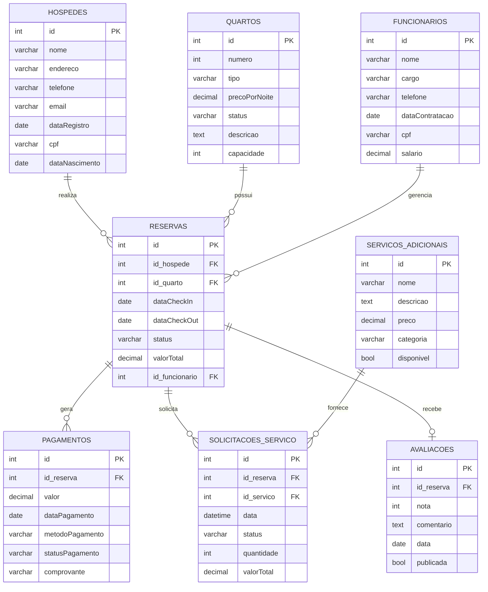

<style>
    body {
        font-family: Arial, sans-serif;
        line-height: 1.6;
        max-width: 1000px;
        margin: 0 auto;
        padding: 20px;
    }
    h1 {
        color: #3a3a3a;
        text-align: center;
        border-bottom: 2px solid #3a3a3a;
        padding-bottom: 10px;
    }
    h2 {
        color: #2c3e50;
        margin-top: 30px;
        border-bottom: 1px solid #eee;
        padding-bottom: 5px;
    }
    h3 {
        color: #3498db;
        margin-top: 20px;
    }
    .section {
        background-color: #f9f9f9;
        padding: 15px;
        margin-bottom: 20px;
        border-radius: 5px;
        border-left: 5px solid #3498db;
    }
    pre {
        background-color: #f5f5f5;
        padding: 15px;
        border-radius: 5px;
        overflow: auto;
    }
    table {
        width: 100%;
        border-collapse: collapse;
        margin: 15px 0;
    }
    th, td {
        border: 1px solid #ddd;
        padding: 8px;
        text-align: left;
    }
    th {
        background-color: #f2f2f2;
    }
</style>

# Modelo de Banco de Dados para Sistema de Reserva de Hotel

## Visão Geral

Este documento descreve o modelo físico de banco de dados para um sistema de reserva de hotel, incluindo quartos, hóspedes, funcionários, reservas, pagamentos, serviços adicionais e avaliações.

## Modelo Físico do Banco de Dados

<div class="section">

### Diagrama do Modelo Físico



</div>

## Detalhamento das Entidades

<div class="section">
<h3>QUARTOS</h3>
<table>
  <tr>
    <th>Atributo</th>
    <th>Tipo</th>
    <th>Restrições</th>
    <th>Descrição</th>
  </tr>
  <tr>
    <td>id</td>
    <td>INT</td>
    <td>PK, AUTO_INCREMENT</td>
    <td>Identificador único do quarto</td>
  </tr>
  <tr>
    <td>numero</td>
    <td>INT</td>
    <td>NOT NULL, UNIQUE</td>
    <td>Número do quarto</td>
  </tr>
  <tr>
    <td>tipo</td>
    <td>VARCHAR(50)</td>
    <td>NOT NULL</td>
    <td>Tipo de quarto (simples, duplo, suíte)</td>
  </tr>
  <tr>
    <td>precoPorNoite</td>
    <td>DECIMAL(10,2)</td>
    <td>NOT NULL</td>
    <td>Valor cobrado por noite</td>
  </tr>
  <tr>
    <td>status</td>
    <td>VARCHAR(20)</td>
    <td>NOT NULL, DEFAULT 'disponível'</td>
    <td>Status atual do quarto (disponível, ocupado, em manutenção)</td>
  </tr>
  <tr>
    <td>descricao</td>
    <td>TEXT</td>
    <td>NULL</td>
    <td>Descrição detalhada do quarto</td>
  </tr>
  <tr>
    <td>capacidade</td>
    <td>INT</td>
    <td>NOT NULL</td>
    <td>Número máximo de pessoas</td>
  </tr>
</table>
</div>

<div class="section">
<h3>HOSPEDES</h3>
<table>
  <tr>
    <th>Atributo</th>
    <th>Tipo</th>
    <th>Restrições</th>
    <th>Descrição</th>
  </tr>
  <tr>
    <td>id</td>
    <td>INT</td>
    <td>PK, AUTO_INCREMENT</td>
    <td>Identificador único do hóspede</td>
  </tr>
  <tr>
    <td>nome</td>
    <td>VARCHAR(100)</td>
    <td>NOT NULL</td>
    <td>Nome completo do hóspede</td>
  </tr>
  <tr>
    <td>endereco</td>
    <td>VARCHAR(200)</td>
    <td>NOT NULL</td>
    <td>Endereço completo</td>
  </tr>
  <tr>
    <td>telefone</td>
    <td>VARCHAR(20)</td>
    <td>NOT NULL</td>
    <td>Número de telefone</td>
  </tr>
  <tr>
    <td>email</td>
    <td>VARCHAR(100)</td>
    <td>NOT NULL, UNIQUE</td>
    <td>Endereço de e-mail</td>
  </tr>
  <tr>
    <td>dataRegistro</td>
    <td>DATE</td>
    <td>NOT NULL, DEFAULT CURRENT_DATE</td>
    <td>Data de cadastro no sistema</td>
  </tr>
  <tr>
    <td>cpf</td>
    <td>VARCHAR(14)</td>
    <td>NOT NULL, UNIQUE</td>
    <td>CPF do hóspede</td>
  </tr>
  <tr>
    <td>dataNascimento</td>
    <td>DATE</td>
    <td>NOT NULL</td>
    <td>Data de nascimento</td>
  </tr>
</table>
</div>

<div class="section">
<h3>FUNCIONARIOS</h3>
<table>
  <tr>
    <th>Atributo</th>
    <th>Tipo</th>
    <th>Restrições</th>
    <th>Descrição</th>
  </tr>
  <tr>
    <td>id</td>
    <td>INT</td>
    <td>PK, AUTO_INCREMENT</td>
    <td>Identificador único do funcionário</td>
  </tr>
  <tr>
    <td>nome</td>
    <td>VARCHAR(100)</td>
    <td>NOT NULL</td>
    <td>Nome completo do funcionário</td>
  </tr>
  <tr>
    <td>cargo</td>
    <td>VARCHAR(50)</td>
    <td>NOT NULL</td>
    <td>Cargo ou função</td>
  </tr>
  <tr>
    <td>telefone</td>
    <td>VARCHAR(20)</td>
    <td>NOT NULL</td>
    <td>Número de telefone</td>
  </tr>
  <tr>
    <td>dataContratacao</td>
    <td>DATE</td>
    <td>NOT NULL</td>
    <td>Data de contratação</td>
  </tr>
  <tr>
    <td>cpf</td>
    <td>VARCHAR(14)</td>
    <td>NOT NULL, UNIQUE</td>
    <td>CPF do funcionário</td>
  </tr>
  <tr>
    <td>salario</td>
    <td>DECIMAL(10,2)</td>
    <td>NOT NULL</td>
    <td>Salário do funcionário</td>
  </tr>
</table>
</div>

<div class="section">
<h3>RESERVAS</h3>
<table>
  <tr>
    <th>Atributo</th>
    <th>Tipo</th>
    <th>Restrições</th>
    <th>Descrição</th>
  </tr>
  <tr>
    <td>id</td>
    <td>INT</td>
    <td>PK, AUTO_INCREMENT</td>
    <td>Identificador único da reserva</td>
  </tr>
  <tr>
    <td>id_hospede</td>
    <td>INT</td>
    <td>FK, NOT NULL</td>
    <td>Referência ao hóspede</td>
  </tr>
  <tr>
    <td>id_quarto</td>
    <td>INT</td>
    <td>FK, NOT NULL</td>
    <td>Referência ao quarto</td>
  </tr>
  <tr>
    <td>dataCheckIn</td>
    <td>DATE</td>
    <td>NOT NULL</td>
    <td>Data de entrada</td>
  </tr>
  <tr>
    <td>dataCheckOut</td>
    <td>DATE</td>
    <td>NOT NULL</td>
    <td>Data de saída</td>
  </tr>
  <tr>
    <td>status</td>
    <td>VARCHAR(20)</td>
    <td>NOT NULL, DEFAULT 'confirmada'</td>
    <td>Status da reserva (confirmada, cancelada, concluída)</td>
  </tr>
  <tr>
    <td>valorTotal</td>
    <td>DECIMAL(10,2)</td>
    <td>NOT NULL</td>
    <td>Valor total da reserva</td>
  </tr>
  <tr>
    <td>id_funcionario</td>
    <td>INT</td>
    <td>FK, NOT NULL</td>
    <td>Funcionário responsável pela reserva</td>
  </tr>
</table>
</div>

<div class="section">
<h3>PAGAMENTOS</h3>
<table>
  <tr>
    <th>Atributo</th>
    <th>Tipo</th>
    <th>Restrições</th>
    <th>Descrição</th>
  </tr>
  <tr>
    <td>id</td>
    <td>INT</td>
    <td>PK, AUTO_INCREMENT</td>
    <td>Identificador único do pagamento</td>
  </tr>
  <tr>
    <td>id_reserva</td>
    <td>INT</td>
    <td>FK, NOT NULL</td>
    <td>Referência à reserva</td>
  </tr>
  <tr>
    <td>valor</td>
    <td>DECIMAL(10,2)</td>
    <td>NOT NULL</td>
    <td>Valor do pagamento</td>
  </tr>
  <tr>
    <td>dataPagamento</td>
    <td>DATE</td>
    <td>NOT NULL</td>
    <td>Data em que o pagamento foi realizado</td>
  </tr>
  <tr>
    <td>metodoPagamento</td>
    <td>VARCHAR(50)</td>
    <td>NOT NULL</td>
    <td>Método utilizado (cartão, dinheiro, pix, etc)</td>
  </tr>
  <tr>
    <td>statusPagamento</td>
    <td>VARCHAR(20)</td>
    <td>NOT NULL, DEFAULT 'pendente'</td>
    <td>Status do pagamento (pendente, confirmado, estornado)</td>
  </tr>
  <tr>
    <td>comprovante</td>
    <td>VARCHAR(200)</td>
    <td>NULL</td>
    <td>Referência ao comprovante de pagamento</td>
  </tr>
</table>
</div>

<div class="section">
<h3>SERVICOS_ADICIONAIS</h3>
<table>
  <tr>
    <th>Atributo</th>
    <th>Tipo</th>
    <th>Restrições</th>
    <th>Descrição</th>
  </tr>
  <tr>
    <td>id</td>
    <td>INT</td>
    <td>PK, AUTO_INCREMENT</td>
    <td>Identificador único do serviço</td>
  </tr>
  <tr>
    <td>nome</td>
    <td>VARCHAR(100)</td>
    <td>NOT NULL</td>
    <td>Nome do serviço</td>
  </tr>
  <tr>
    <td>descricao</td>
    <td>TEXT</td>
    <td>NULL</td>
    <td>Descrição detalhada do serviço</td>
  </tr>
  <tr>
    <td>preco</td>
    <td>DECIMAL(10,2)</td>
    <td>NOT NULL</td>
    <td>Preço unitário</td>
  </tr>
  <tr>
    <td>categoria</td>
    <td>VARCHAR(50)</td>
    <td>NOT NULL</td>
    <td>Categoria (café da manhã, lavanderia, transporte, etc)</td>
  </tr>
  <tr>
    <td>disponivel</td>
    <td>BOOLEAN</td>
    <td>NOT NULL, DEFAULT TRUE</td>
    <td>Indica se o serviço está disponível</td>
  </tr>
</table>
</div>

<div class="section">
<h3>SOLICITACOES_SERVICO</h3>
<table>
  <tr>
    <th>Atributo</th>
    <th>Tipo</th>
    <th>Restrições</th>
    <th>Descrição</th>
  </tr>
  <tr>
    <td>id</td>
    <td>INT</td>
    <td>PK, AUTO_INCREMENT</td>
    <td>Identificador único da solicitação</td>
  </tr>
  <tr>
    <td>id_reserva</td>
    <td>INT</td>
    <td>FK, NOT NULL</td>
    <td>Referência à reserva</td>
  </tr>
  <tr>
    <td>id_servico</td>
    <td>INT</td>
    <td>FK, NOT NULL</td>
    <td>Referência ao serviço</td>
  </tr>
  <tr>
    <td>data</td>
    <td>DATETIME</td>
    <td>NOT NULL, DEFAULT CURRENT_TIMESTAMP</td>
    <td>Data e hora da solicitação</td>
  </tr>
  <tr>
    <td>status</td>
    <td>VARCHAR(20)</td>
    <td>NOT NULL, DEFAULT 'solicitado'</td>
    <td>Status (solicitado, em andamento, concluído, cancelado)</td>
  </tr>
  <tr>
    <td>quantidade</td>
    <td>INT</td>
    <td>NOT NULL, DEFAULT 1</td>
    <td>Quantidade do serviço solicitado</td>
  </tr>
  <tr>
    <td>valorTotal</td>
    <td>DECIMAL(10,2)</td>
    <td>NOT NULL</td>
    <td>Valor total da solicitação</td>
  </tr>
</table>
</div>

<div class="section">
<h3>AVALIACOES</h3>
<table>
  <tr>
    <th>Atributo</th>
    <th>Tipo</th>
    <th>Restrições</th>
    <th>Descrição</th>
  </tr>
  <tr>
    <td>id</td>
    <td>INT</td>
    <td>PK, AUTO_INCREMENT</td>
    <td>Identificador único da avaliação</td>
  </tr>
  <tr>
    <td>id_reserva</td>
    <td>INT</td>
    <td>FK, NOT NULL</td>
    <td>Referência à reserva avaliada</td>
  </tr>
  <tr>
    <td>nota</td>
    <td>INT</td>
    <td>NOT NULL, CHECK (nota BETWEEN 1 AND 5)</td>
    <td>Nota de 1 a 5</td>
  </tr>
  <tr>
    <td>comentario</td>
    <td>TEXT</td>
    <td>NULL</td>
    <td>Comentário do hóspede</td>
  </tr>
  <tr>
    <td>data</td>
    <td>DATE</td>
    <td>NOT NULL, DEFAULT CURRENT_DATE</td>
    <td>Data da avaliação</td>
  </tr>
  <tr>
    <td>publicada</td>
    <td>BOOLEAN</td>
    <td>NOT NULL, DEFAULT FALSE</td>
    <td>Indica se a avaliação está publicada</td>
  </tr>
</table>
</div>

## Relacionamentos e Restrições

<div class="section">

1. **HOSPEDES → RESERVAS**: Um hóspede pode fazer várias reservas (1:N)

    ```sql
    ALTER TABLE RESERVAS ADD CONSTRAINT fk_reserva_hospede
    FOREIGN KEY (id_hospede) REFERENCES HOSPEDES(id);
    ```

2. **QUARTOS → RESERVAS**: Um quarto pode ser reservado várias vezes (em períodos diferentes) (1:N)

    ```sql
    ALTER TABLE RESERVAS ADD CONSTRAINT fk_reserva_quarto
    FOREIGN KEY (id_quarto) REFERENCES QUARTOS(id);
    ```

3. **FUNCIONARIOS → RESERVAS**: Um funcionário pode gerenciar várias reservas (1:N)

    ```sql
    ALTER TABLE RESERVAS ADD CONSTRAINT fk_reserva_funcionario
    FOREIGN KEY (id_funcionario) REFERENCES FUNCIONARIOS(id);
    ```

4. **RESERVAS → PAGAMENTOS**: Uma reserva pode ter vários pagamentos (1:N)

    ```sql
    ALTER TABLE PAGAMENTOS ADD CONSTRAINT fk_pagamento_reserva
    FOREIGN KEY (id_reserva) REFERENCES RESERVAS(id);
    ```

5. **RESERVAS → SOLICITACOES_SERVICO**: Uma reserva pode solicitar vários serviços adicionais (1:N)

    ```sql
    ALTER TABLE SOLICITACOES_SERVICO ADD CONSTRAINT fk_solicitacao_reserva
    FOREIGN KEY (id_reserva) REFERENCES RESERVAS(id);
    ```

6. **SERVICOS_ADICIONAIS → SOLICITACOES_SERVICO**: Um serviço pode ser solicitado várias vezes (1:N)

    ```sql
    ALTER TABLE SOLICITACOES_SERVICO ADD CONSTRAINT fk_solicitacao_servico
    FOREIGN KEY (id_servico) REFERENCES SERVICOS_ADICIONAIS(id);
    ```

7. **RESERVAS → AVALIACOES**: Uma reserva pode ter apenas uma avaliação (1:0-1)

    ```sql
    ALTER TABLE AVALIACOES ADD CONSTRAINT fk_avaliacao_reserva
    FOREIGN KEY (id_reserva) REFERENCES RESERVAS(id);

    ALTER TABLE AVALIACOES ADD CONSTRAINT uk_reserva_avaliacao
    UNIQUE (id_reserva);
    ```

</div>

## Índices Recomendados

<div class="section">

Para otimizar o desempenho do banco de dados, recomenda-se a criação dos seguintes índices:

```sql
-- Índices para pesquisas comuns
CREATE INDEX idx_quarto_tipo ON QUARTOS(tipo);
CREATE INDEX idx_quarto_status ON QUARTOS(status);
CREATE INDEX idx_hospede_nome ON HOSPEDES(nome);
CREATE INDEX idx_hospede_email ON HOSPEDES(email);
CREATE INDEX idx_funcionario_cargo ON FUNCIONARIOS(cargo);

-- Índices para estrangeiras
CREATE INDEX idx_reserva_hospede ON RESERVAS(id_hospede);
CREATE INDEX idx_reserva_quarto ON RESERVAS(id_quarto);
CREATE INDEX idx_reserva_datas ON RESERVAS(dataCheckIn, dataCheckOut);
CREATE INDEX idx_pagamento_reserva ON PAGAMENTOS(id_reserva);
CREATE INDEX idx_solicitacao_reserva ON SOLICITACOES_SERVICO(id_reserva);
CREATE INDEX idx_solicitacao_servico ON SOLICITACOES_SERVICO(id_servico);
```

</div>

## Considerações de Implementação

<div class="section">

-   Deve-se implementar validação para garantir que não haja reservas sobrepostas para o mesmo quarto
-   É importante manter o status dos quartos atualizado automaticamente com base nas reservas
-   A tabela PAGAMENTOS pode ser expandida para incluir informações de faturamento e impostos
-   Pode ser necessário criar uma tabela intermediária para gerenciar ocupantes adicionais em uma reserva
-   É recomendável implementar um sistema de log para rastrear alterações em reservas e pagamentos

</div>
