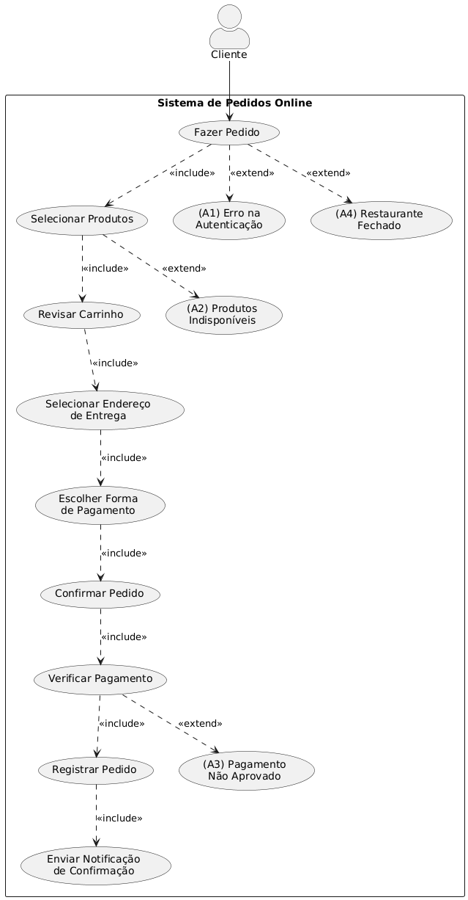
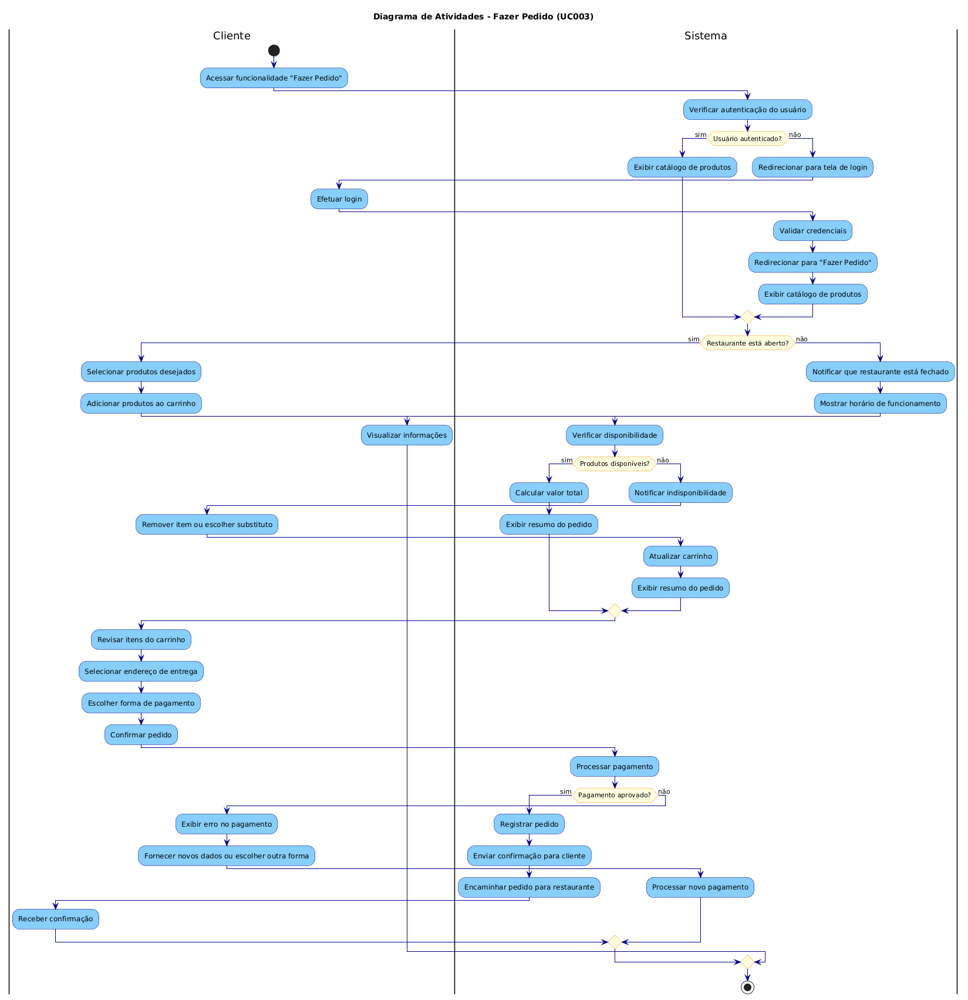

  <h1>Sistema de Delivery de Comida (Estilo iFood)</h1>
  <h2>Documentação do Projeto</h2>

  <h2>Índice</h2>
  <ol>
    <li><a href="#1-introducao">Introdução</a></li>
    <li><a href="#2-visao-geral">Visão Geral do Sistema</a></li>
    <li><a href="#3-modelagem">Modelagem do Sistema</a>
      <ul>
        <li><a href="#3-1-diagrama-casos-uso">Diagrama de Casos de Uso</a></li>
        <li><a href="#3-2-diagrama-atividades">Diagrama de Atividades</a></li>
    <li><a href="#4-conclusao">Conclusão</a></li>
  </ol>

  <h2>1. Introdução</h2>
  

    Este documento descreve o projeto de um Sistema de Delivery de Comida estilo iFood, 
    desenvolvido como atividade para a disciplina de Engenharia de Software II.
    O sistema permitirá que clientes façam pedidos de comida de diversos restaurantes,
    acompanhem o status do pedido e recebam suas entregas.
  

  <h2>2. Visão Geral do Sistema</h2>
  

    O sistema de delivery de comida é uma plataforma que conecta três principais atores:
    clientes, restaurantes e entregadores. Os clientes podem navegar por restaurantes cadastrados,
    visualizar menus, fazer pedidos e acompanhar entregas. Os restaurantes podem gerenciar seus
    cardápios, receber pedidos e atualizá-los. Os entregadores podem aceitar entregas e
    atualizar o status da entrega.
  

  
  <h3>Principais Funcionalidades:</h3>
  <ul>
    <li>Cadastro e autenticação de usuários (clientes, restaurantes, entregadores)</li>
    <li>Busca e navegação de restaurantes</li>
    <li>Visualização de cardápios</li>
    <li>Realização de pedidos</li>
    <li>Processamento de pagamentos</li>
    <li>Acompanhamento de pedidos em tempo real</li>
    <li>Gestão de restaurantes e cardápios</li>
    <li>Gestão de entregas</li>
    <li>Avaliações e feedback</li>
  </ul>

  <h2>3. Modelagem do Sistema</h2>
  
  

    <h3>3.1 Diagrama de Casos de Uso</h3>
    

      O diagrama de casos de uso representa as principais interações entre os usuários e o sistema.
      Para detalhes completos, consulte: 
      <a href="casos-uso.md">Casos de Uso do Sistema de Delivery</a>
    

    
  

  

    <h3>3.1 Diagrama de Atividades</h3>
    

      Um Diagrama de Atividades (UML) é uma representação gráfica que descreve o fluxo de atividades em um sistema, mostrando a sequência de ações e decisões. Ele é usado para modelar processos de negócios e fluxos de trabalho.
      <a href="casos-uso.md">Casos de Uso do Sistema de Delivery</a>
    

    
  

  <h2>4. Conclusão</h2>
  

    Este documento apresenta uma visão geral da documentação do Sistema de Delivery de Comida.
    Os documentos referenciados contêm detalhes específicos sobre cada aspecto do sistema.
    Esta documentação servirá como guia para o desenvolvimento do sistema.
  

